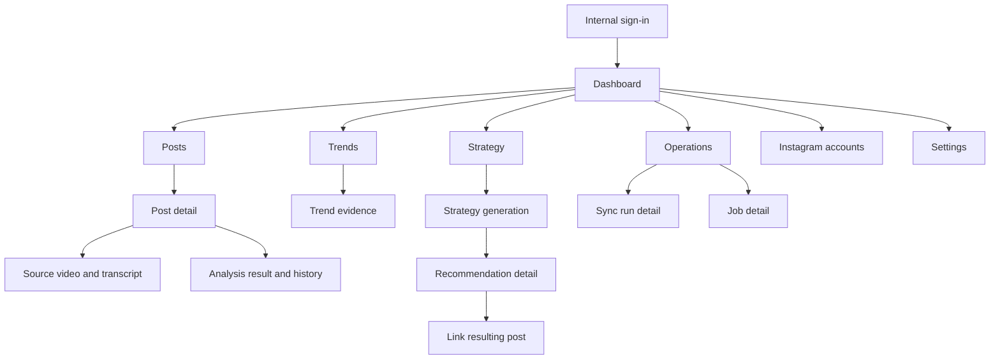

# V1 screen map

## Navigation

Primary navigation: **Dashboard**, **Posts**, **Trends**, **Strategy**, **Operations**.
Secondary/admin navigation: **Instagram accounts**, **Settings**, user/session menu.

## Screens

| Route (proposed) | Screen | Primary purpose | Key states/actions |
| --- | --- | --- | --- |
| `/login` | Internal sign-in | Authenticate approved staff | Sign in; denied, expired-session and provider-error states |
| `/` | Dashboard | Current account health and highest-value next actions | Connect account, sync, upload missing videos, review failures, generate strategy |
| `/accounts` | Instagram accounts | Configure authorised professional accounts | Connect, reconnect, disconnect, token/scope health, last sync |
| `/accounts/:accountId` | Account detail | Account-specific settings and sync history | Manual sync, configured schedule, health and imported counts |
| `/posts` | Imported posts | Find and triage Reels | Search/filter by publication date, association, analysis and attention state; pagination |
| `/posts/:postId` | Post detail | Unified evidence for one post | Metrics, source inputs, analysis status/result/history, analyse/reanalyse |
| `/posts/:postId/source` | Source video and transcript | Upload/replace/delete asset and edit source context | Upload progress/recovery; transcript/script/notes/tags; validation errors |
| `/trends` | Trends dashboard | Compare creative features with performance | Account/date/metric filters; supported, directional, outlier and insufficient states |
| `/trends/:statisticId` | Trend evidence | Explain one comparison | Formula, cohort, sample, baseline, difference, uncertainty, referenced posts |
| `/strategy` | Strategy index | View current and historical strategies | Generate, queued/error/insufficient states, history |
| `/strategy/:strategyId` | Strategy detail | Present evidence-linked plan | Working/not working/tests/next videos/evidence/limitations; regenerate |
| `/recommendations/:recommendationId` | Recommendation detail | Turn a strategy item into an actionable brief | Status, hook options, structure, filming, editing, CTA, evidence, resulting-post link |
| `/operations` | Processing operations | Find work requiring attention | Filters for sync/job/incomplete post/token/storage states; safe retry |
| `/operations/syncs/:syncRunId` | Sync run detail | Diagnose import work | Counts, cursor/state, rate limit, redacted errors, retry/resume |
| `/operations/jobs/:jobId` | Job detail | Diagnose analysis/strategy work | Attempts, stages, version metadata, usage, redacted error, retry/cancel-if-pending |
| `/settings` | Internal settings | View/edit safe operational configuration | Active schema/prompt/model, limits, retention; secret values never rendered |

## Dashboard hierarchy

1. Integration health and blocking alerts.
2. Work requiring manual attention.
3. Current strategy summary and recommended next videos.
4. Recent post performance and analysis coverage.
5. Recent processing activity.

## Strategy hierarchy

1. What appears to be working.
2. What appears not to be working.
3. What Studio Parallel should test next.
4. Recommended next videos.
5. Evidence and confidence.
6. Data limitations.

## Shared states

- **Loading:** preserve page structure with labelled skeletons; status changes use polite live regions.
- **Empty:** explain why the state is empty and the one prerequisite action.
- **Partial:** render available sections and name missing sources/metrics.
- **Error:** state the failed operation, whether data is safe, correlation ID and safe next action.
- **Unauthorised/not found:** use a non-enumerating response; do not reveal whether a crafted identifier exists elsewhere.
- **Mobile:** sticky primary action only when it does not cover content; filters use an accessible sheet; tables retain headers and scroll horizontally.
