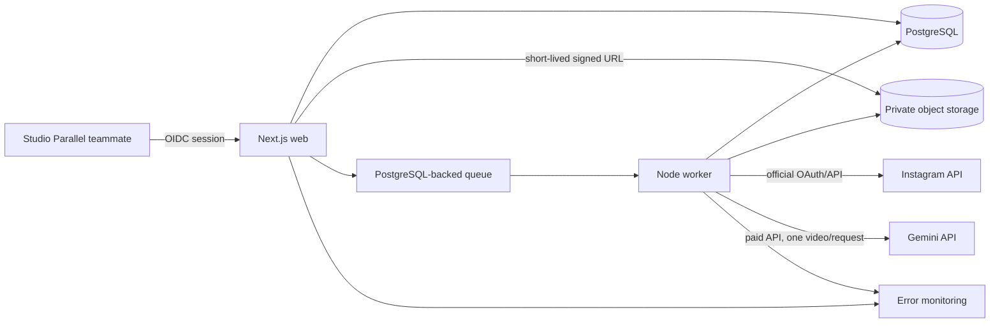
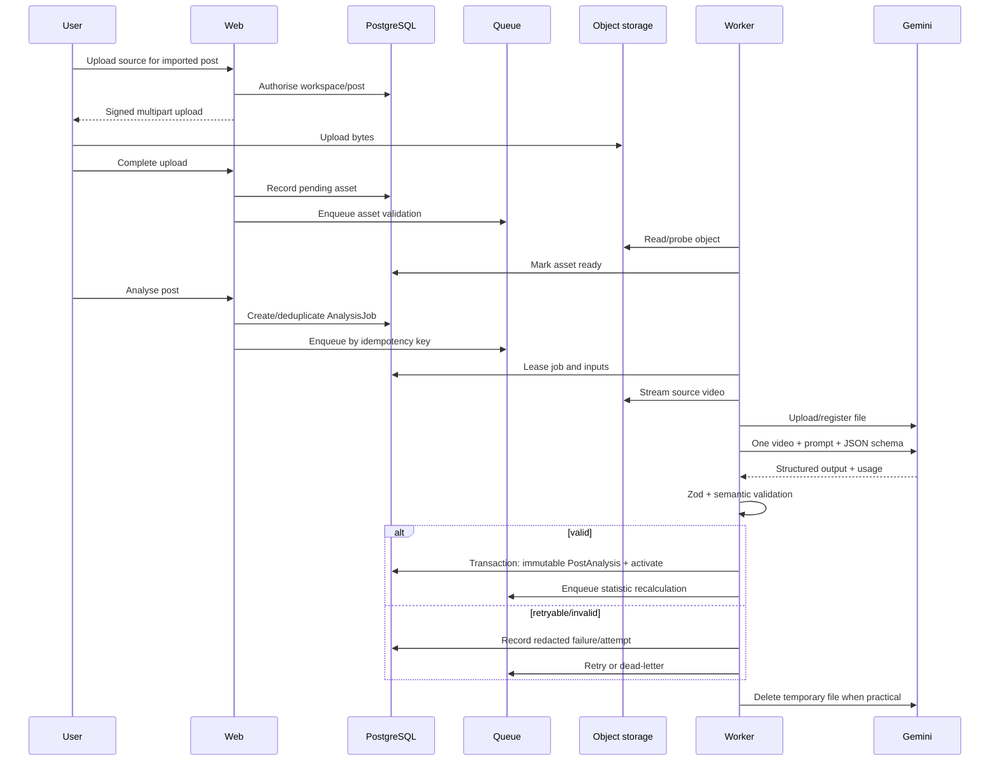

# Technical architecture

Status: proposed v1 baseline
Last reviewed: 2026-07-28

## Decision summary

Because the repository is empty, v1 uses a small TypeScript monorepo with a Next.js web application, a separate Node.js worker, shared domain packages, PostgreSQL/Prisma, a PostgreSQL-backed queue, private S3-compatible object storage, Google Workspace OIDC, the official Instagram API and the paid Gemini Developer API.

The architecture has one Studio Parallel workspace but applies `workspace_id` at ownership boundaries. It does not implement public tenancy, billing, granular roles, autonomous agents, a vector database, Redis, Kafka, Kubernetes or dedicated ML infrastructure.

Recommended repository shape:

```text
apps/
  web/                 Next.js App Router UI and server-only routes/actions
  worker/              long-lived Node worker and scheduled enqueue tasks
packages/
  config/              typed environment configuration
  db/                  Prisma schema, migrations and repositories
  domain/              states, formulas, policies and Zod contracts
  integrations/        Meta, Gemini and object-storage adapters
  observability/       logging, tracing/error-monitoring helpers
tests/
  fixtures/            provider, AI and fixed analytics fixtures
docs/
```

This is a logical boundary, not a requirement for independently versioned services.

## Components and responsibilities

| Component | Owns | Does not own |
| --- | --- | --- |
| Next.js web | Internal UI, OIDC session, server authorisation, signed-upload initiation, commands/queries, status reads, **one assistant turn** | Long-running imports, media probing, or any AI call other than an assistant turn |
| Worker | Sync, token maintenance, asset validation, Gemini analysis, analytics recalculation, strategy generation, cleanup/reconciliation | User session decisions or direct browser trust |
| PostgreSQL | Product records, immutable snapshots/analyses/strategies, queue metadata, idempotency, audit/provenance | Original video bytes or plaintext secrets outside encrypted columns |
| PostgreSQL-backed queue | Durable scheduling, leases, retries, priority and dead-letter state | Business truth; job outcome is committed in domain tables |
| Private object storage | Original source video and optional derived validation metadata | Provider credentials, public URLs or strategy evidence |
| Instagram adapter | Official OAuth/API calls, pagination, payload normalisation, rate-limit/error classification | Retry policy, product availability semantics or metrics calculation |
| Gemini adapter | File lifecycle, one-video request, structured response capture, provider usage metadata | Queueing, schema activation, database/file operations or statistics |
| Analytics engine | Comparable cohort selection, formulas, robust baselines, uncertainty, outlier tests | Creative extraction or causal conclusions |
| Strategy retriever/generator | Evidence manifest selection, prompt assembly, structured strategy validation | Raw-video account aggregation or unsupported evidence claims |

## Context diagram



## Processing sequence



Account strategy generation is a separate job. It reads stored analyses and application-calculated statistics, freezes a bounded evidence manifest, calls Gemini with text/structured evidence only, validates the response and stores an immutable generation plus evidence links.

### The assistant: the one AI call the web process makes

One assistant turn is a single short text request with no video, no file upload and no queue, answered inside the request that asked for it. Queueing it would buy no isolation — there is nothing long-running to survive, and no provider file to clean up — while delivering a conversation one poll interval at a time. A reader is waiting, so the call runs in the web process under a timeout sized for a person rather than for a job, and the reply is validated before it is stored or shown.

`runChatTurn` in `apps/web/src/lib/server/chat-turn.ts` is the only web path that calls a provider. Everything else the model is asked — post analysis, strategy generation — still belongs to the worker, and the boundary above holds for all of it. The consequence for deployment is that `GEMINI_API_KEY` is now required in the web environment as well as the worker's; it is loaded lazily inside the live branch, so a build and a `PROVIDER_MODE=fake` boot still need nothing.

Context assembly is a registry rather than a query. Each source in `packages/db/src/chat-context.ts` turns work already done — the current strategy and its frozen manifest, the published comparisons, the account, its recent posts — into one block of prose, and `assembleChatContext` bounds the total and records which sources survived. A new source is a new entry in that array; the call path does not change. Only the strategy makes evidence citable, because its manifest is the one set of ids this product already resolves to a trend or a post.

## Technology choices and alternatives

### Next.js + Node worker

Use Next.js App Router for the internal UI/server surface and a separately deployed Node process for jobs. A single Next.js-only deployment was rejected because video probing, polling and long AI calls must survive request termination. A larger service mesh is unnecessary for v1.

### PostgreSQL + Prisma

PostgreSQL provides relational integrity, JSONB provenance and queue durability. Prisma supplies typed migrations and repositories. Raw SQL is allowed in the analytics package for window/percentile operations, covered by fixed-dataset tests. A document database would weaken cross-record evidence and idempotency constraints.

### PostgreSQL-backed queue

Use `pg-boss` (pin and review the current stable release at implementation) so v1 does not introduce Redis solely for jobs. It supports a long-lived worker, retries and scheduling while keeping operational data close to PostgreSQL. If production load or provider isolation outgrows it, the queue adapter can move to a managed queue without changing domain job records.

### Private S3-compatible storage

Use a private Cloudflare R2 bucket by default (or an organisation-approved S3 equivalent) with presigned multipart access. The adapter keeps provider choice replaceable. Database blobs and Instagram CDN URLs are rejected as durable storage.

### Authentication

Use Google Workspace OIDC through Auth.js, explicit email allowlisting and an `InternalUser` record. Domain matching alone is insufficient. Sessions are server-validated and commands re-authorise the workspace resource.

### Gemini

Initial candidate is the pinned stable `gemini-3.6-flash`, which currently accepts video, provides a 1,048,576-token input window and structured outputs. Before launch, run the gold fixture against a lower-cost stable candidate and preserve the chosen exact model in settings and every result. Do not use a moving `latest` alias. See `ai-analysis-contract.md`.

### Deployment

Deploy two container processes (web and worker) on one managed application platform, one managed PostgreSQL instance and one private object-store bucket. A single region near Studio Parallel and available provider endpoints is preferred. See `deployment-and-operations.md`.

## Security boundaries

1. Browser input is untrusted. It never receives Meta/Gemini secrets or permanent object URLs.
2. Web commands derive the actor/workspace from the session, then load resources by `(workspace_id, id)`; client-supplied workspace IDs are not authoritative.
3. Worker jobs carry opaque internal IDs. The worker re-loads authoritative records and uses service-level credentials with least privilege.
4. Integration credentials are envelope-encrypted before PostgreSQL storage; key material lives in the deployment secret manager.
5. Object keys are random, workspace-prefixed and never accepted directly from a client after upload initiation.
6. External responses are untrusted: schemas, semantic rules, length limits and error classification apply before database publication.

## Failure handling

- Commands write domain state and enqueue in one transaction/outbox boundary where possible; reconciliation detects committed-but-not-enqueued work.
- A job records stage, attempt, lease, heartbeat and correlation ID. Lease expiry permits recovery.
- Provider 429 and transient 5xx/timeouts retry with bounded exponential backoff and jitter; permanent 4xx, permission, invalid-media and semantic-validation exhaustion require attention.
- Item-level import failures do not fail already committed pages. A cursor/checkpoint allows resumption.
- A failed reanalysis never replaces the current validated analysis.
- Strategy evidence is frozen before model invocation; retry uses the same manifest and version unless the user explicitly starts a new generation.
- Object/Gemini cleanup failures are retried separately and do not erase a valid analysis.

Detailed policy is in `background-jobs.md`.

## Idempotency

- Instagram account: `(workspace_id, provider_account_id)`.
- Post: `(instagram_account_id, provider_media_id)`.
- Metric snapshot: `(post_id, captured_at_bucket, source_api_version, payload_hash)` with a separate provider request ID when present.
- Upload completion: client-generated upload intent ID plus object version/etag.
- Analysis: `(post_id, video_asset_version_id, transcript_revision_id/null, schema_version_id, prompt_version, model_id, request_config_hash)`.
- Strategy: `(account_id, evidence_manifest_hash, strategy_schema_version, prompt_version, model_id, request_options_hash)`.
- Queue dispatch: domain job ID; retries never create a new logical job.

## Versioning

- Provider API version is explicit configuration and stored with every sync/snapshot.
- Analysis schemas are immutable, named semantic versions with JSON Schema/Zod hash and lifecycle state: draft, active, retired.
- Prompts have immutable version/hash and evaluation notes.
- The business background is an immutable named version with its own hash, carried in both the strategy and assistant instructions and recorded against every strategy it shaped.
- Models use pinned stable identifiers. Model ID and returned provider metadata are stored.
- Formula/cohort logic has an `analytics_version`; materialised statistics can be recomputed and historical versions retained when used as evidence.
- Strategy schema/prompt/model and exact evidence manifest are immutable per generation.

## Observability

All web and worker logs are JSON with timestamp, level, service, environment, release, workspace/account/post/job identifiers where safe, event name, stage, attempt, duration, provider status/error class and correlation ID. Token values, signed URLs, transcript/video content and raw AI prompts/responses are excluded.

Metrics include queue depth/age, success/failure/retry counts, provider latency and 429s, sync coverage, job stage duration, invalid-AI-response rate, token counts/cost estimates, temporary-file cleanup lag, storage bytes and stale credentials. Alerts target sustained backlog, dead-letter growth, token expiry, sync staleness and error spikes.

## Cost-sensitive decisions

- One video per request and bounded output schema.
- Configurable per-provider concurrency and token/request budgets.
- Source object is streamed; Gemini File API copies are deleted after use and expire automatically.
- No default context cache because each video is normally analysed once per version; no File Search/vector store.
- No Batch API in interactive v1: the application queue already supplies retries/visibility and users need predictable completion. A future backfill mode may use Batch after measured demand.
- Materialise feature statistics after data changes rather than recalculating large cohorts on every page view.
- Record usage before estimating cost; pricing remains configuration, not a hard-coded accounting claim.

## Extension points without v1 complexity

- `Workspace` ownership permits basic later separation.
- Provider adapters can add other authorised networks without changing post-analysis contracts.
- Queue and object-store interfaces permit provider replacement.
- Versioned schemas/formulas permit safe reprocessing.
- Recommendation-result links create a future experiment feedback loop.

None of these extension points authorises public SaaS, cross-workspace access or new networks in v1.
