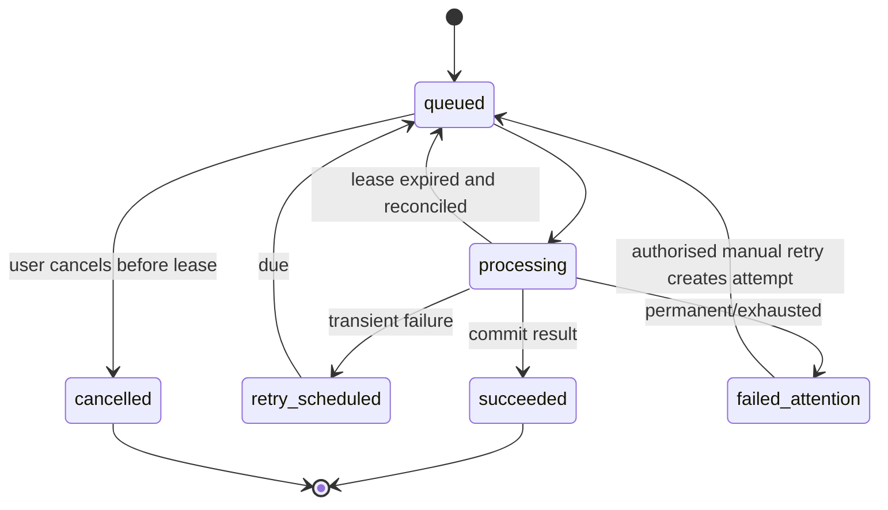

# Background jobs and reliability

## Queue model

Use a PostgreSQL-backed queue (`pg-boss` `12.26.3`, exact-pinned) consumed by a long-lived Node
worker. Domain tables remain the source of user-visible state; queue rows are delivery mechanics.
Web requests create/deduplicate domain work and its outbox record inside one Prisma transaction;
the worker publishes committed outbox records.

The release lifecycle runs `npm run queue:migrate` after Prisma migrations and before either
application process is promoted. The command applies pg-boss's dedicated `pgboss` schema,
provisions the versioned queues and performs a drift check. Runtime processes set pg-boss migration
off. Worker startup verifies the installed schema and queue policies before leasing; a missing or
unsupported handler version fails compatibility rather than consuming that delivery.

No Gemini or Meta call runs inside a browser request. No autonomous/persistent agent owns a post.

## Job types

| Queue | Unit of work | Suggested priority/concurrency |
| --- | --- | --- |
| `instagram.sync.account` | One logical account media import/checkpoint | High/manual, normal/scheduled; one/account |
| `instagram.snapshot.post` | One post insight retrieval and immutable snapshot | Provider-limited; small per-account pool |
| `instagram.token.maintain` | Validate/refresh one credential | High; one/credential |
| `asset.validate` | Probe one uploaded object version | Medium CPU-limited pool |
| `asset.cleanup` | Delete one object/provider-file/dead multipart set | Low, retryable |
| `analysis.run` | One post/video/schema/prompt/model signature | User priority; Gemini concurrency budget |
| `analytics.recalculate` | One account/version input set | Debounced; one/account/version |
| `strategy.generate` | One frozen manifest/version | User priority; small Gemini pool |
| `system.reconcile` | Find domain/queue/cleanup inconsistencies | Scheduled singleton |

Queue names and handler versions are configuration, included in logs/deploy compatibility checks.

## Logical state machine

Stages refine processing (for analysis: `loading_inputs`, `uploading_file`, `waiting_file`, `generating`, `validating`, `committing`, `cleaning_up`). Stage names are safe, bounded identifiers rather than free-form content. State transitions use a versioned compare-and-swap and a unique attempt number, so concurrent deliveries produce one lease and one active attempt.

## Creation and dispatch

1. Command transaction locks/loads the owned resource.
2. Compute canonical idempotency key and find a matching queued/processing/succeeded logical job.
3. Return the existing job when duplicate; otherwise insert domain job plus outbox record.
4. Dispatcher claims due outbox records with a short expiring PostgreSQL lease, publishes using the
   domain job UUID as both pg-boss delivery ID and singleton key, then atomically marks the outbox
   and domain dispatch state.
5. Reconciler republishes failed, unleased or expired-lease outbox entries. A crash after publish but
   before marking reuses the same queue delivery ID, so recovery is safe.

If `pg-boss` transactional send shares the same database transaction safely, the outbox can be a thin audit layer; do not rely on an HTTP request performing two unrelated commits.

## Leasing, heartbeat and concurrency

- Workers take bounded batches and hold a queue lease.
- Long handlers heartbeat both queue and domain job at a configured interval shorter than lease expiry.
- A heartbeat extends the domain lease and its attempt atomically. Reconciliation only requeues a
  processing job after `lease_expires_at`; it never steals a healthy lease. An expired final attempt
  moves to `failed_attention` rather than starting an unbounded paid call.
- Global and per-provider semaphores cap Gemini/Meta calls; per-account locks stop overlapping syncs/token refreshes.
- Asset probing uses a separate CPU pool/process constraint.
- Shutdown stops leasing, lets short work finish within grace, persists checkpoint/heartbeat and returns unfinished leases.
- A deploy compatibility check prevents a worker missing a required handler/schema version from leasing it.

Initial conservative defaults (configuration, tune with measured quotas):

- Gemini analysis: 2 concurrent/project, 1 concurrent/account.
- Strategy: 1 concurrent/project.
- Meta HTTP: 2 concurrent/account with adaptive throttling from response headers.
- Asset validation: 2 concurrent/worker instance.

## Retry classification

Default bounded exponential delays with full jitter; provider `Retry-After`/usage guidance takes precedence. A provider hint can lengthen a delay but cannot extend the job beyond its configured attempt cap or the 24-hour retry horizon.

| Failure | Attempts/delay | Terminal behaviour |
| --- | --- | --- |
| Network timeout/reset, provider 5xx | Up to 5; ~30s, 2m, 10m, 30m, 2h plus jitter | `failed_attention` |
| 429/quota | Up to 8 within 24h; provider hint/adaptive budget | attention if quota/config persists |
| Token temporarily refreshable | One serialized refresh then original retry | reconnect required on invalid/revoked |
| Gemini schema/semantic output | One repair request; optionally one clean regeneration if configured | attention; no partial publish |
| Invalid/corrupt/unsupported asset | No blind retry | attention with replace action |
| Permission/invalid identifier | No retry until configuration/user action | attention/reconnect |
| Database serialization/deadlock | Short retry up to 3 | attention/alert |
| Cleanup/delete transient | Up to 10 over 48h | cleanup-debt alert; valid result remains |

Handler-specific policy can be stricter. The shared framework stores only an allowlisted error class,
stable code and safe next action on the logical job and attempt. Provider-specific tables may retain
an opaque request ID. Do not store exception messages, tokens, signed URLs, request bodies,
transcripts or videos in error records or job logs.

## Idempotent handler pattern

Every handler:

1. Loads domain job by internal ID and validates type/version/state.
2. Checks whether the matching terminal result already exists; if so, marks delivery successful.
3. Claims/updates state with optimistic lock and records attempt/stage.
4. Performs side effects with provider idempotency/reconciliation where available.
5. Commits the immutable result and terminal job state in one transaction.
6. Enqueues follow-up work using outbox/dedup keys.
7. Runs cleanup as a separate idempotent concern.

`runIdempotentJobHandler` owns steps 1-5. A handler receives only its leased identifiers, abort
signal, heartbeat and stage callbacks, and returns a `TransactionalJobResult`. Its `commit` callback
runs in the same Prisma transaction that marks the job and attempt succeeded. Re-delivery after that
commit returns `ALREADY_SUCCEEDED` without invoking the handler. A crash before commit leaves the
lease for the reconciler; no partial result is visible.

External side effects record provider object/request IDs immediately. If a worker crashes after upload but before completion, the next attempt reuses or deletes the known provider file rather than blindly uploading duplicates.

## Cancellation and manual retry

- V1 cancellation is supported only while queued/retry-scheduled or at safe pre-provider checkpoints.
- Processing cancellation is cooperative; the UI says “cancellation requested” and never promises provider work can be revoked mid-call.
- Manual retry is allowed for terminal failed jobs after server-side permission and prerequisite checks. It preserves the logical job/evidence signature and adds an attempt; if inputs/version intentionally change, create a new job.
- Retrying a sync resumes the committed cursor or starts a new explicit run depending on failure class.
- No bulk retry/delete in v1.

## Dead-letter and reconciliation

`failed_attention` is the domain dead-letter state. Operations shows job type, resource, stage, attempts, last/next time, stable error class, safe message, correlation ID and action.

Scheduled reconciliation checks:

- queued domain job without queue/outbox delivery;
- expired processing lease/heartbeat;
- result committed but job not terminal;
- Gemini file past cleanup due;
- upload intent/object mismatch or abandoned multipart;
- sync cursor/run stale;
- analytics dirty account without recalculation job;
- strategy manifest without terminal generation.

Repairs are idempotent and auditable; ambiguous data is flagged rather than guessed.

## Observability

Structured events: job created/deduplicated/dispatched/started/stage/retried/succeeded/failed/cancelled, provider request completed, result committed and cleanup completed. Include job/resource/correlation/attempt/handler-version IDs, durations, safe provider status and usage counts.

Metrics/alerts:

- queue depth and oldest age by type;
- running/leased and heartbeat lag;
- outcome/retry/dead-letter counts and rates;
- stage/provider latency;
- Meta 429/credential errors and Gemini invalid-output/file failures;
- cleanup debt and object bytes;
- analysis token/cost estimates;
- stale sync/statistic time.

Alert thresholds are defined in the runbook and tested in production smoke checks.

## Testing

- Unit-test transition and retry classifiers with fake time/jitter seed.
- Integration-test transactional dedupe/outbox and concurrent claim behaviour against PostgreSQL.
- Crash-injection tests at every external-side-effect/commit boundary.
- Contract fixtures for provider 429/5xx/invalid auth/unsupported metric/file states.
- Handler tests prove repeated delivery yields one logical result/snapshot/analysis.
- Lease expiry, graceful shutdown, manual retry/cancel and reconciler repairs are covered.
- Load smoke test validates configured concurrency and queue-age alerts without calling paid APIs.
