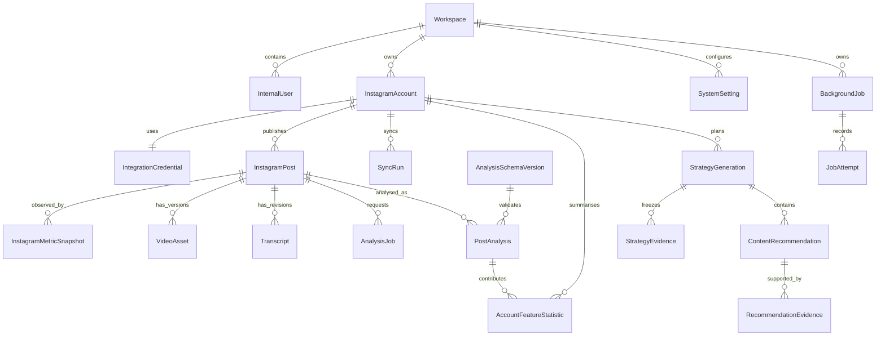

# Data model

## Conventions

- UUIDv7 (or monotonic UUID) primary keys; provider IDs remain strings.
- UTC `timestamptz` for storage; display in the user’s configured timezone.
- Mutable tables include `created_at`, `updated_at` and optimistic `version` where concurrent edits matter.
- User-facing deletes are soft state transitions first; object/secret purge is an auditable background workflow.
- Every workspace-owned query includes `workspace_id` directly or through a required parent join.
- Enums are domain states with explicit transitions; unknown provider enum values are retained in raw payloads.
- Sensitive JSON/content columns are excluded from default ORM projections and logs.

## Relationship overview

## Entity catalogue

### Workspace

- **Purpose/ownership:** root Studio Parallel data boundary; one seeded row in v1.
- **Important fields:** `id`, `slug`, `name`, `timezone`, `status`.
- **Relationships:** owns users, accounts and settings.
- **Constraints/indexes:** unique `slug`; index `status`.
- **Retention/sensitivity:** retained while product exists; no secrets.

### InternalUser

- **Purpose/ownership:** authorised staff identity within the workspace.
- **Fields:** `id`, `workspace_id`, `oidc_subject`, normalised `email`, `display_name`, `status`, v1 `role` (`member`/`admin`), `last_login_at`.
- **Relationships:** audit actor for user commands.
- **Constraints/indexes:** unique `(workspace_id, oidc_subject)` and normalised email; indexes on status/email.
- **Retention/sensitivity:** personal data; deactivate rather than erase audit references, with name/email minimisation on approved deletion.

### InstagramAccount

- **Purpose/ownership:** one authorised Business or Creator account.
- **Fields:** `id`, `workspace_id`, `provider_account_id`, `username`, `account_type`, profile metadata, follower count observed time, `connection_status`, `token_expires_at`, `granted_scopes`, `last_successful_sync_at`, `api_version`.
- **Relationships:** credential, posts, sync runs, statistics and strategies.
- **Constraints/idempotency:** unique `(workspace_id, provider_account_id)`; one active connection per provider account/workspace.
- **Indexes:** workspace/status, token expiry, last sync.
- **Retention/sensitivity:** account metadata; disconnect revokes credential and stops new provider work but does not automatically erase historical internal analysis.

### IntegrationCredential

- **Purpose/ownership:** encrypted credential material for an integration.
- **Fields:** `id`, `workspace_id`, `integration_type`, `account_id`, encrypted ciphertext, key version, token type, issued/expires/refreshed times, scope hash, status, last validation error class.
- **Constraints:** unique active credential per `(integration_type, account_id)`; never use ciphertext as idempotency input.
- **Indexes:** expiry/status.
- **Retention/sensitivity:** highly sensitive. Envelope-encrypted; purge on disconnect after revocation attempt; never logged, returned or included in backups without database encryption controls.

### InstagramPost

- **Purpose/ownership:** normalised imported owned media record.
- **Fields:** `id`, `workspace_id`, `instagram_account_id`, `provider_media_id`, `media_type`, `media_product_type`, `caption`, `permalink`, `published_at`, optional provider duration/thumbnail URL, `provider_updated_at`, import/attention state, raw metadata payload/hash/API version, `current_video_asset_id`, `current_transcript_id`, `current_analysis_id`.
- **Relationships:** snapshots, asset/transcript versions, jobs, analyses; optionally resulting post for a recommendation.
- **Constraints/idempotency:** unique `(instagram_account_id, provider_media_id)`; check current child IDs belong to the same post.
- **Indexes:** account/published time, account/product type, association/analysis/attention states.
- **Retention/sensitivity:** caption and raw payload may be internal content. Provider deletion marks unavailable/tombstoned; historical evidence is retained unless account/data deletion policy removes it.

### InstagramMetricSnapshot

- **Purpose/ownership:** immutable observation of one post’s metrics at one retrieval time.
- **Fields:** `id`, `workspace_id`, `post_id`, `sync_run_id`, `captured_at`, `post_age_seconds`, optional target cadence, API version, provider request ID, nullable typed values (`views`, `plays`, `reach`, `likes`, `comments`, `shares`, `saves`, total/average watch time, profile visits/activity, follows and other supported fields), `availability` JSONB keyed by canonical metric, raw payload/hash, follower count context.
- **Constraints/idempotency:** unique dedupe key `(post_id, captured_at_bucket, api_version, payload_hash)`; all counts non-negative; units explicit (milliseconds for time).
- **Indexes:** `(post_id, captured_at desc)`, `(post_id, post_age_seconds)`, sync run.
- **Retention/sensitivity:** retain for longitudinal comparisons; deletion follows post/account purge. Raw payload access is restricted.

### VideoAsset

- **Purpose/ownership:** versioned durable source-video association.
- **Fields:** `id`, `workspace_id`, `post_id`, `version`, random object key, bucket/region, object version/etag, declared/detected MIME, bytes, checksum, duration, dimensions/codecs, validation state/error class, upload intent ID, uploaded/validated/deleted times, created by.
- **Constraints/idempotency:** unique `(post_id, version)`, upload intent ID, and object key; only one current ready asset on the post.
- **Indexes:** post/version, validation state, deletion/retention due time.
- **Retention/sensitivity:** private source content. Delete workflow revokes access, prevents new jobs, deletes object/derived copies, tombstones metadata and evaluates downstream analysis deletion policy.

### Transcript

- **Purpose/ownership:** versioned spoken text and source context.
- **Fields:** `id`, `workspace_id`, `post_id`, `revision`, `text`, `source` (`user`, `gemini`, `imported`, `none`), language, original script, intended audience, objective, notes, category tags, created by/time, deleted time.
- **Constraints:** unique `(post_id, revision)`; size limits; exactly one current revision pointer.
- **Indexes:** post/revision; optional GIN tags, not full content by default.
- **Retention/sensitivity:** internal creative content; deletion tombstones content and blocks reuse. Historical analyses retain a revision ID and input hash, not necessarily a recoverable deleted transcript body.

### AnalysisSchemaVersion

- **Purpose/ownership:** immutable structured-output and semantic-validation contract.
- **Fields:** `id`, semantic `version`, lifecycle state, JSON Schema, Zod/source hash, field dictionary, prompt compatibility, created/activated/retired metadata.
- **Constraints:** unique semantic version and schema hash; only one active default per analysis type.
- **Indexes:** lifecycle/version.
- **Retention/sensitivity:** never delete once referenced.

### AnalysisJob

- **Purpose/ownership:** durable logical request to analyse one post input set.
- **Fields:** `id`, `workspace_id`, `post_id`, asset/transcript/schema IDs, prompt/model/config versions, `idempotency_key`, state/stage, priority, attempts/max, queued/started/heartbeat/completed/next-attempt times, provider file name/expiry, usage metadata, redacted error code/class/detail, correlation ID, requested by.
- **Relationships:** produces zero or one `PostAnalysis`; may have queue delivery records.
- **Constraints/idempotency:** unique idempotency key for non-cancelled logical request; state transition checks.
- **Indexes:** state/next attempt, post/time, heartbeat, correlation ID.
- **Retention/sensitivity:** operational metadata retained for audit (recommended 180 days, aggregate thereafter); no raw prompt/token/video.

### BackgroundJob

- **Purpose/ownership:** workspace-owned logical execution record shared by every asynchronous handler; queue rows remain delivery mechanics.
- **Fields:** queue and handler version, idempotency/correlation keys, logical state and safe stage, priority, optimistic version, attempt counters, optional resource/input version, queue/start/heartbeat/lease/retry/completion times, allowlisted error class/code/next action, cooperative cancellation request/reason, and reconciliation finding/time.
- **Relationships:** owns one outbox record and ordered `JobAttempt` records; handler-specific jobs or results refer to its stable ID.
- **Constraints/idempotency:** unique `(workspace_id, queue_name, handler_version, idempotency_key)`; reusing that key with different resource, input version, attempt cap or priority is a conflict. State, lease, timing, stage, resource, cancellation, reconciliation and error shapes are database-checked.
- **Indexes:** workspace/state/due time/priority, state/lease expiry and correlation ID.
- **Retention/sensitivity:** identifiers and safe operational metadata only; no provider payload, prompt, transcript, media, token, URL or raw exception.

### JobAttempt

- **Purpose/ownership:** immutable-numbered execution history for one claimed `BackgroundJob` lease.
- **Fields:** attempt and handler version, state/stage (including cooperative cancellation), unique lease and correlation IDs, start/heartbeat/completion/next-attempt times, and allowlisted error class/code/next action.
- **Constraints/idempotency:** unique `(background_job_id, attempt_number)` and lease ID; ownership is enforced by a composite workspace/job foreign key. Active, retry and terminal timing/error shapes are database-checked.
- **Indexes:** workspace/state/start time and job/completion time.
- **Retention/sensitivity:** follows the logical job; contains no handler inputs, result bodies or exception text.

### PostAnalysis

- **Purpose/ownership:** one immutable, validated creative analysis of one video.
- **Fields:** `id`, `workspace_id`, `post_id`, job/input IDs and hashes, schema version, prompt version/hash, model ID/version, analysed time, validated structured JSON, extracted searchable feature columns, field-confidence JSON, estimation labels, transcript provenance, provider usage/finish/safety metadata, latency, `analytics_eligible`, validation warnings.
- **Constraints/idempotency:** unique analysis request signature; response must pass the referenced schema and semantic validator; current pointer changes transactionally.
- **Indexes:** post/time, schema/model, analytics eligibility and common categorical features.
- **Retention/sensitivity:** contains derived internal content. Historical versions retained for reproducibility; source deletion policy decides whether derived content is retained, redacted or purged.

### AccountFeatureStatistic

- **Purpose/ownership:** materialised deterministic trend result for an account, feature/value and metric.
- **Fields:** `id`, `workspace_id`, `account_id`, `analytics_version`, feature path/value, canonical metric, date range, snapshot-age cohort, group/comparison sizes, medians, ratio/difference, bootstrap interval/p-value/q-value when applicable, effect/sensitivity/outlier flags, confidence class, relevant post/analysis/snapshot IDs or a linked membership table, calculated time, input fingerprint.
- **Constraints/idempotency:** unique statistic key plus input fingerprint; numeric fields require compatible units.
- **Indexes:** account/date/metric/confidence, feature/value.
- **Retention/sensitivity:** replaceable materialisation, but versions referenced by strategy evidence cannot be deleted.

### StrategyGeneration

- **Purpose/ownership:** one immutable account strategy result.
- **Fields:** `id`, `workspace_id`, `account_id`, requested period/options, state, strategy schema/prompt/model versions, evidence manifest/hash, idempotency key, structured output, narrative summary, confidence/limitation summary, usage/latency, generated time, requested by, redacted failure.
- **Constraints:** unique idempotency key; published output must validate and only reference evidence in the frozen manifest.
- **Indexes:** account/generated time, state.
- **Retention/sensitivity:** retained as history; purge with workspace/account deletion according to policy.

### StrategyEvidence

- **Purpose/ownership:** typed, immutable join from a strategy claim/section to evidence.
- **Fields:** `id`, `strategy_generation_id`, `claim_key`, `evidence_type` (`post_analysis`, `metric_snapshot`, `feature_statistic`, `post`), referenced ID, role (`supporting`, `counterexample`, `limitation`, `context`), rank/retrieval reason, frozen display summary/hash.
- **Constraints:** referenced record belongs to same workspace/account; unique claim/evidence/role.
- **Indexes:** strategy/claim/rank, referenced type/id.
- **Retention:** prevents removal of referenced statistical versions until the strategy is deleted.

### ContentRecommendation

- **Purpose/ownership:** actionable proposed future video/experiment within one strategy.
- **Fields:** `id`, workspace/account/strategy IDs, stable recommendation key, title, pillar, topic, format, audience, hook options, structure, filming/editing/CTA guidance, rationale, evidence class, limitations, experiment/hypothesis/success metric, state (`proposed`, `selected`, `completed`, `dismissed`), state actor/time/reason, optional resulting post ID, semantic fingerprint for duplicate detection.
- **Constraints:** resulting post belongs to same account/workspace; state transitions audited.
- **Indexes:** account/state, strategy/order, semantic fingerprint.
- **Retention:** retained with strategy; linking a post does not modify historical evidence.

### RecommendationEvidence

- **Purpose/ownership:** typed support/counterevidence for a recommendation.
- **Fields:** recommendation ID, evidence type/reference, role, claim key, rank and explanation.
- **Constraints/indexes:** same ownership/reference checks as `StrategyEvidence`; unique recommendation/reference/role.
- **Retention:** follows recommendation and protects referenced evidence versions.

### SyncRun

- **Purpose/ownership:** auditable logical Instagram import/snapshot run.
- **Fields:** `id`, workspace/account, trigger (`bootstrap`, `manual`, `scheduled`, `reconcile`), idempotency key, state/stage, requested range/cadence, cursor/checkpoint, counts, attempts/times, API version, usage/rate-limit header summary, correlation ID, redacted failure/requested by.
- **Constraints:** one active run per account/purpose window; cursor is opaque.
- **Indexes:** account/start time, state/next action.
- **Retention:** detailed operational metadata 180 days recommended; aggregate beyond that.

### SystemSetting

- **Purpose/ownership:** safe, versioned operational configuration.
- **Fields:** workspace/global scope, key, typed non-secret value, version, effective times, changed by/reason.
- **Constraints:** unique active `(scope, key)`; allowlisted keys and schema validation.
- **Indexes:** scope/key/effective time.
- **Retention/sensitivity:** change history retained. Secrets are references to secret-manager entries, never values.

## Additional supporting entities

- `AuditEvent`: actor/service, action, resource, safe outcome/reason codes, before/after hashes, time and correlation ID for access-sensitive mutations.
- `JobOutbox` and queue-native metadata: durable dispatch intent and physical delivery remain separate from `BackgroundJob` and `JobAttempt` execution state.
- `DeletionRequest`: scope, requested/approved/executed actor/times, dependency plan and outcome.
- `StatisticPostMembership`: normalised list of posts/snapshots/analyses contributing to a statistic when JSON arrays would become unwieldy.
- `PromptVersion`: immutable prompt text or secure artifact hash, analysis/strategy kind, evaluation status and compatibility.

## Deletion effects

1. **Disconnect account:** revoke/purge credential, cancel future syncs, retain imported/evidence data unless erase is separately chosen.
2. **Delete asset:** immediately revoke new signed access and analysis eligibility; asynchronously delete object and temporary provider copies; preserve tombstone/checksum and follow the approved derived-analysis rule.
3. **Delete transcript:** remove body/script/notes, current pointer and future use; retain hashes/provenance necessary to explain historical analyses.
4. **Erase post/account/workspace:** compute evidence dependencies, cancel jobs, delete provider credentials and objects, then delete or irreversibly anonymise derived records in a documented order. No orphan evidence references.
